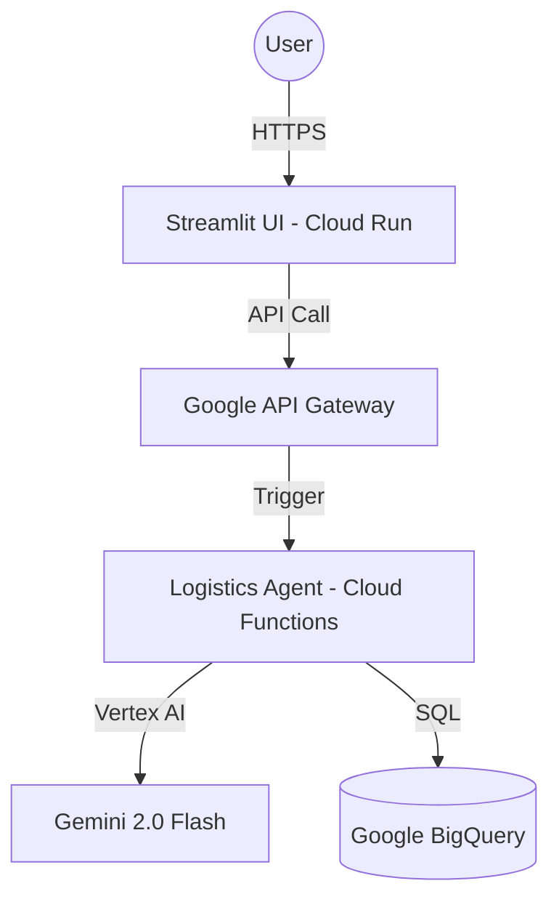

# AI Logistics Control Tower 🚚

An AI-powered logistics orchestration platform that translates natural language queries into SQL, executes them against Google BigQuery, and provides intelligent insights using Gemini 2.0 Flash and LangChain.

## 🏗️ Architecture

The system is built on a 100% serverless Google Cloud architecture:

- **Frontend**: [Streamlit](https://streamlit.io/) application hosted on **Google Cloud Run**.
- **API Management**: **Google API Gateway** for secure, managed access.
- **Backend Logic**: **Google Cloud Functions (2nd Gen)** running a LangChain SQL Agent.
- **LLM**: **Gemini 2.0 Flash** via Vertex AI for natural language understanding and SQL generation.
- **Database**: **Google BigQuery** for high-performance logistics data storage.



## 📂 Project Structure

- `app.py`: Frontend UI (Streamlit).
- `agents.py`: core logic for the AI Agent.
- `backend/main.py`: Entry point for the Cloud Function.
- `backend/openapi.yaml`: OpenAPI specification for the API Gateway.
- `Dockerfile`: Deployment configuration for the Cloud Run frontend.
- `setup_bigquery.py`: utility to initialize BigQuery tables and mock data.

## 🚀 Deployment Steps

### 1. Prerequisites
- Google Cloud Project with Billing enabled.
- Enabled APIs: Cloud Functions, Cloud Run, API Gateway, BigQuery, Vertex AI.

### 2. Backend Deployment (Cloud Function)
```bash
gcloud functions deploy logistics-agent-func \
    --gen2 \
    --runtime=python311 \
    --region=us-central1 \
    --source=./backend \
    --entry-point=process_query \
    --trigger-http \
    --allow-unauthenticated \
    --set-env-vars "DATABASE_URL=bigquery://YOUR_PROJECT_ID/logistics_control_tower"
```

### 3. API Gateway Deployment
1. Update `backend/openapi.yaml` with your Cloud Function URL.
2. Create and deploy the gateway:
```bash
gcloud api-gateway apis create logistics-gateway
gcloud api-gateway api-configs create logistics-v1 --api=logistics-gateway --openapi-spec=backend/openapi.yaml
gcloud api-gateway gateways create logistics-gateway --api=logistics-gateway --api-config=logistics-v1 --location=us-central1
```

### 4. Frontend Deployment (Cloud Run)
```bash
gcloud run deploy logistics-frontend \
    --source . \
    --region=us-central1 \
    --allow-unauthenticated \
    --set-env-vars "API_URL=https://YOUR_GATEWAY_URL"
```

## 🛠️ Local Development
1. Install dependencies: `pip install -r requirements.txt`
2. Run Streamlit locally: `streamlit run app.py`

---
*Developed for AI Logistics Orchestration*
