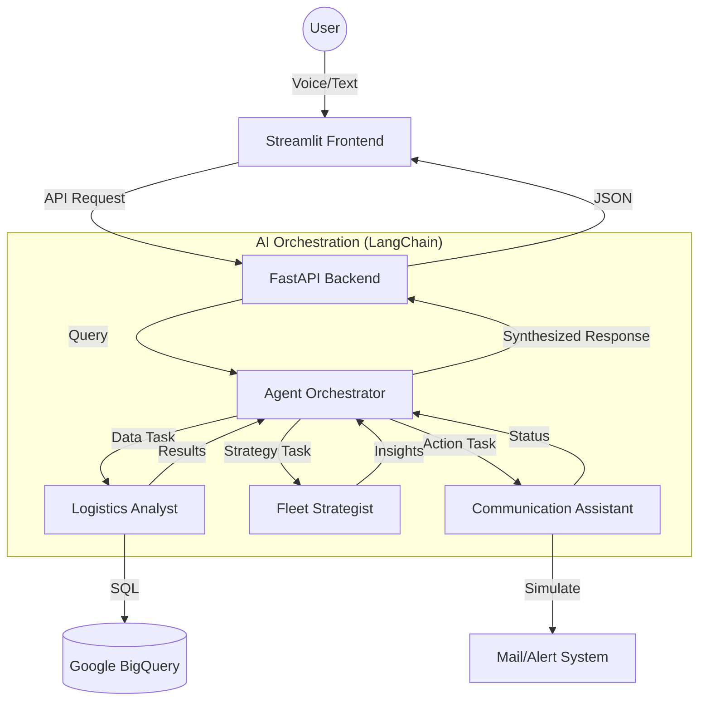

# 🚚 Cloud-Native Multi-Agent Logistics Control Tower (V3.2)

A state-of-the-art, cloud-native logistics management system powered by **Gemini 2.0 Flash** and **LangChain**. This system orchestrates multiple AI agents to provide data-driven insights, operational strategy, and automated communication.

## 🏗️ Architecture Overview

The system follows a modern, decoupled architecture designed for scalability and intelligence:

- **Frontend**: Streamlit-based interactive dashboard with Voice-to-Text capabilities, Role-Based Access Control (RBAC), and a Data Explorer.
- **Backend**: FastAPI services deployed on **Google Cloud Run**, acting as the brain for AI orchestration.
- **AI Brain**: **LangChain** multi-agent framework utilizing **Gemini 2.0 Flash** (Experimental) via Google Vertex AI.
- **Data Layer**: **Google BigQuery** serving as the centralized data warehouse for shipment, fleet, and driver data.
- **Security**: Granular RBAC implemented at the AI context layer to ensure data privacy.



## 🌟 Key Features

### 1. 🤖 Collaborative Multi-Agent Workflow
- **Logistics Analyst**: Directly queries BigQuery using natural language to extract specific data points.
- **Fleet Strategist**: Takes data results and applies business logic to suggest optimizations.
- **Communication Assistant**: Handles outgoing notifications and simulated email workflows.

### 2. 🎤 Multimodal Interaction
- **Voice-to-Query**: Integrated microphone support allows users to speak their requests (e.g., "Show me delayed shipments").
- **Smart Transcription**: Automated conversion of audio to text for seamless AI processing.

### 3. 🛡️ Role-Based Access Control (RBAC)
- **Logistics Manager**: Full access to financial and operational data.
- **Fleet Operator**: Access to operational status; restricted from seeing costs and profits.
- **Guest**: Highly restricted access to basic public shipment status only.

### 4. 📊 Static & Live Data Explorer
- Instantly view sample data schemas to understand the available logistics information without hitting the database repeatedly.

### 5. 📧 Integrated Communication Hub
- Centralized UI for checking alerts and sending simulated notifications to dispatchers and drivers.

## 📁 Project Structure

```text
multi-agent-voice-concierge/
├── app.py                  # Streamlit Frontend (UI, Voice, RBAC Logic)
├── agents.py               # Core AI Orchestration (LangChain, Gemini 2.0 Flash)
├── backend/
│   ├── main.py             # FastAPI App (Endpoints, Serialization)
│   ├── agents.py           # Synced AI logic for cloud deployment
│   ├── Dockerfile          # Backend container configuration
│   └── requirements.txt    # Backend dependencies
├── tests/
│   └── verify_prod.py      # Automated verification script
├── Dockerfile              # Frontend container configuration
├── requirements.txt        # Frontend dependencies
└── README.md               # Project documentation
```

## 🛠️ Multi-Agent Workflow Detail

When a user asks: *"Why is the London shipment delayed and who should I notify?"*

1.  **Orchestrator** receives the query and identifies it needs **Data** and **Action**.
2.  **Logistics Analyst** generates a BigQuery SQL query to find shipment #123 (London) and retrieves the status and driver details.
3.  **Fleet Strategist** analyzes the delay reason (e.g., weather) and suggests a reroute or alert.
4.  **Communication Assistant** prepares a simulated email draft for the dispatcher.
5.  **Orchestrator** synthesizes all these into a single, cohesive response for the user.

## 🚀 Getting Started

1.  **Environment Variables**:
    - `API_URL`: URL of the deployed FastAPI backend.
    - `DATABASE_URL`: BigQuery connection string.
2.  **Deployment**:
    - Backend: `gcloud run deploy ... --source ./backend`
    - Frontend: `gcloud run deploy ... --source .`
3.  **Requirements**:
    - Project must have **Vertex AI** and **BigQuery** APIs enabled.
    - Gemini 2.0 Flash model should be enabled in **Model Garden**.

---
*Created with ❤️ for Advanced Logistics Engineering.*
