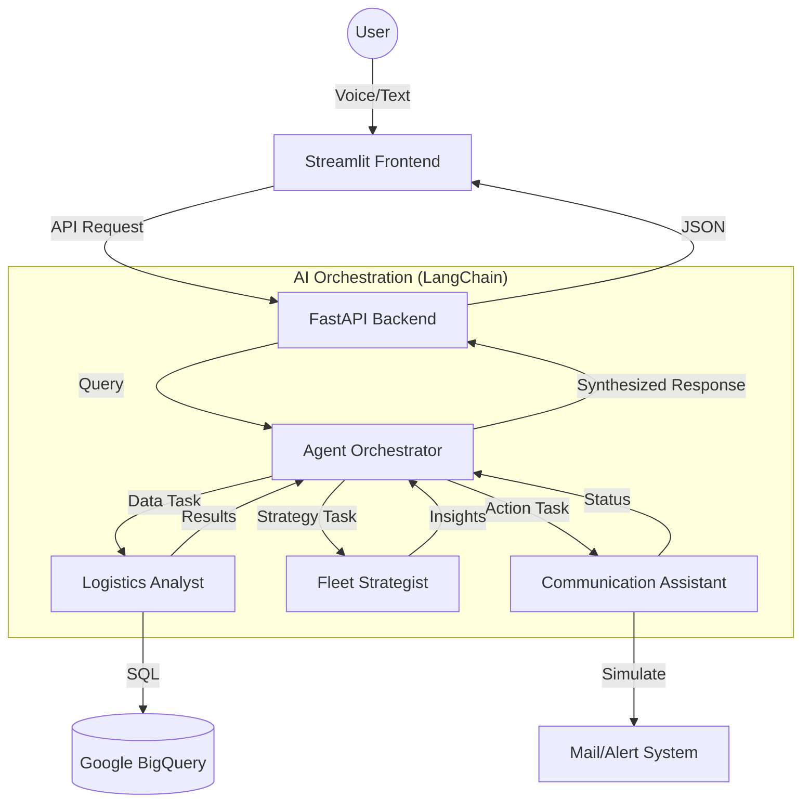

# 🚚 Cloud-Native Multi-Agent Logistics Control Tower (V3.2)

A state-of-the-art, cloud-native logistics management system powered by **Gemini 2.0 Flash** and **LangChain**. This system orchestrates multiple AI agents to provide data-driven insights, operational strategy, and automated communication.

## 🏗️ Architecture Overview

The system follows a modern, decoupled architecture designed for scalability and intelligence:

- **Frontend**: Streamlit-based interactive dashboard with Voice-to-Text capabilities, Role-Based Access Control (RBAC), and a Data Explorer.
- **Backend**: FastAPI services deployed on **Google Cloud Run**, acting as the brain for AI orchestration.
- **AI Brain**: **LangChain** multi-agent framework utilizing **Gemini 2.0 Flash** (Experimental) via Google Vertex AI.
- **Data Layer**: **Google BigQuery** serving as the centralized data warehouse for shipment, fleet, and driver data.
- **Security**: Granular RBAC implemented at the AI context layer to ensure data privacy.



## 🌟 Key Features

### 1. 🤖 Collaborative Multi-Agent Workflow
- **Logistics Analyst**: Directly queries BigQuery using natural language to extract specific data points.
- **Fleet Strategist**: Takes data results and applies business logic to suggest optimizations.
- **Communication Assistant**: Handles outgoing notifications and simulated email workflows.

### 2. 🎤 Multimodal Interaction
- **Voice-to-Query**: Integrated microphone support allows users to speak their requests (e.g., "Show me delayed shipments").
- **Smart Transcription**: Automated conversion of audio to text for seamless AI processing.

### 3. 🛡️ Role-Based Access Control (RBAC)
- **Logistics Manager**: Full access to financial and operational data.
- **Fleet Operator**: Access to operational status; restricted from seeing costs and profits.
- **Guest**: Highly restricted access to basic public shipment status only.

### 4. 📊 Static & Live Data Explorer
- Instantly view sample data schemas to understand the available logistics information without hitting the database repeatedly.

### 5. 📧 Integrated Communication Hub
- Centralized UI for checking alerts and sending simulated notifications to dispatchers and drivers.

### 6. 🧠 Conversational Memory & Follow-ups
- **Short-Term Memory**: Remembers the last 5 interactions to maintain context.
- **Smart Follow-ups**: AI suggests logical next steps or questions based on the current analysis.

#### 🧪 Memory Demonstration Scenarios
| Scenario | Initial Question | Memory Follow-up (Context Aware) |
| :--- | :--- | :--- |
| **Operational** | "List all shipments that are currently 'Delayed'." | "What is the **total revenue** for these shipments?" |
| **Fleet Ops** | "Show me all 'Heavy Trucks' in the fleet." | "Are any of **them** over 100,000 km in mileage?" |
| **Strategy** | "Identify shipments with a cost higher than $1,500." | "What are the **cargo types** for these specific orders?" |

## �️ Tech Stack

- **Frontend**: [Streamlit](https://streamlit.io/) (Data Dashboard), [SpeechRecognition](https://pypi.org/project/SpeechRecognition/) & [Pydub](https://pub.dev/packages/pydub) (Voice Processing)
- **Backend API**: [FastAPI](https://fastapi.tiangolo.com/) (High-performance Python API)
- **AI Orchestration**: [LangChain](https://www.langchain.com/) (Multi-agent framework)
- **LLM**: [Google Gemini 2.0 Flash Experimental](https://deepmind.google/technologies/gemini/) (via Vertex AI)
- **Data Warehouse**: [Google BigQuery](https://cloud.google.com/bigquery)
- **Infrastructure**: [Google Cloud Run](https://cloud.google.com/run) (Serverless Containers)
- **Database Connectivity**: [SQLAlchemy-BigQuery](https://github.com/googleapis/python-bigquery-sqlalchemy)

## �📁 Project Structure

```text
multi-agent-voice-concierge/
├── app.py                  # Streamlit Frontend (UI, Voice, RBAC Logic)
├── agents.py               # Core AI Orchestration (LangChain, Gemini 2.0 Flash)
├── backend/
│   ├── main.py             # FastAPI App (Endpoints, Serialization)
│   ├── agents.py           # Synced AI logic for cloud deployment
│   ├── Dockerfile          # Backend container configuration
│   └── requirements.txt    # Backend dependencies
├── tests/
│   └── verify_prod.py      # Automated verification script
├── Dockerfile              # Frontend container configuration
├── requirements.txt        # Frontend dependencies
└── README.md               # Project documentation
```

## 🛠️ Multi-Agent Workflow Detail

When a user asks: *"Why is the London shipment delayed and who should I notify?"*

1.  **Orchestrator** receives the query and identifies it needs **Data** and **Action**.
2.  **Logistics Analyst** generates a BigQuery SQL query to find shipment #123 (London) and retrieves the status and driver details.
3.  **Fleet Strategist** analyzes the delay reason (e.g., weather) and suggests a reroute or alert.
4.  **Communication Assistant** prepares a simulated email draft for the dispatcher.
5.  **Orchestrator** synthesizes all these into a single, cohesive response for the user.

## ⚙️ Local Setup & Configuration

Follow these steps to get the project running on your local machine.

### 1. Prerequisites
- **Python 3.9+** installed.
- A **Google Cloud Project** with billing enabled.
- **Google Cloud CLI** installed (`gcloud auth login`).

### 2. Clone & Install
```bash
git clone https://github.com/ashokkumar261261/ai-logistics-control-tower.git
cd ai-logistics-control-tower
python -m venv venv
source venv/bin/activate  # Windows: venv\\Scripts\\activate
pip install -r requirements.txt
```

### 3. Google Cloud Authentication
1.  **Service Account**: 
    - Create a Service Account in your [GCP Console](https://console.cloud.google.com/iam-admin/serviceaccounts).
    - Assign roles: `BigQuery Admin`, `Vertex AI User`.
    - Download the JSON key, rename it to `service-account.json`, and place it in the **root directory**.
2.  **Environment Variables**:
    - The code uses `service-account.json` for local BigQuery and Vertex AI access.

### 4. Configuration Update
You MUST update the `PROJECT_ID` in the following files to match your Google Cloud Project:
- `setup_bigquery.py` (Line 10)
- `agents.py` (Line 10)
- `backend/main.py` (Line 7)
- `backend/agents.py` (Line 10)

### 5. Data & AI Environment Setup
Run the initialization script to create the BigQuery dataset, migrate sample data, and configure the BQML Gemini model:
```bash
python setup_bigquery.py
```

### 6. Run Locally
```bash
streamlit run app.py
```

## 🚀 Deployment Guide (Google Cloud)

### 1. Prerequisites
- Install [Google Cloud SDK](https://cloud.google.com/sdk/docs/install).
- Enable required APIs:
  ```bash
  gcloud services enable run.googleapis.com \
                         aiplatform.googleapis.com \
                         bigquery.googleapis.com \
                         artifactregistry.googleapis.com
  ```

### 2. Deploy Backend
Navigate to the root and run:
```bash
gcloud run deploy logistics-agent-backend \
    --source ./backend \
    --region=us-central1 \
    --allow-unauthenticated \
    --set-env-vars "DATABASE_URL=bigquery://[YOUR_PROJECT_ID]/logistics_control_tower" \
    --memory=1Gi
```
*Note the Service URL returned after deployment.*

### 3. Deploy Frontend
Run from the root directory:
```bash
gcloud run deploy logistics-frontend \
    --source . \
    --region=us-central1 \
    --allow-unauthenticated \
    --set-env-vars "API_URL=[YOUR_BACKEND_URL]"
```

### 4. Setup BigQuery
Ensure a dataset named `logistics_control_tower` exists in your project with the required tables (`shipments`, `vehicles`, `drivers`).

## 💡 Queries to Try (Advanced Logistics Intelligence)
Explore the power of the multi-agent system with these specific queries:
- **Profitability**: *"Which shipments have the highest profit margin (revenue - cost)?"*
- **HR & Performance**: *"List all drivers with a rating above 4.5 and more than 8 years of experience."*
- **Maintenance**: *"Are there any active vehicles with fuel levels below 20%?"*
- **Urgent Ops**: *"Identify shipments carrying 'Medical Supplies' that are currently delayed."*

## ✨ Latest V3.2 Features Added
- **Conversational Memory**: The agent now remembers previous context within the session.
- **AI Suggested Follow-ups**: Dynamic question chips generated by Gemini 2.0 based on current analysis.
- **Enriched Data Layer**: New columns for Revenue, Weight, Fuel Level, Driver Ratings, and more.
- **Enhanced Voice-to-Text**: Lower latency transcription for mobile and desktop usage.

---
*Created with ❤️ for Advanced Logistics Engineering.*
